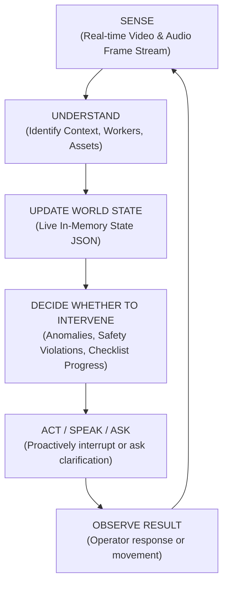
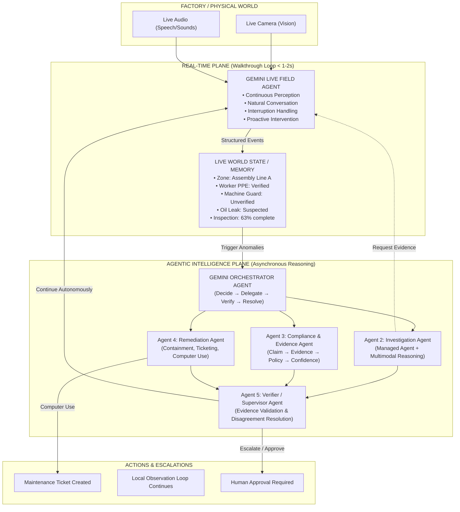
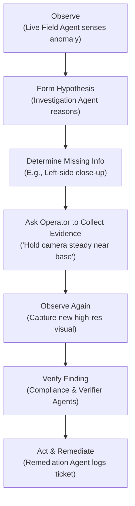

<div align="center">
  
</div>

# Sentinel 🛡️
### Autonomous Multimodal Safety & Quality Agent

> **"Gemini Live understands what is happening now. Managed Agents decide what should happen next."**

---

## 💡 One-Line Pitch

A continuously aware multimodal agent that walks the factory floor with an operator, understands the evolving state of an inspection, proactively detects hazards and process deviations, gathers verifiable evidence, and delegates deeper investigation and remediation to managed Gemini agents.

---

## 🌟 The Core Vision: Real-Time Physical Operations

Sentinel is not just an offline safety checker or simple checklist app; it is a **real-time physical operations agent**. By bridging the gap between immediate physical environments and enterprise intelligence, Sentinel manages the real-time feedback loop directly on the factory floor.



---

## 🏗️ Google-Native Architecture

Sentinel operates using **two distinct computing planes** to remain highly responsive, cost-effective, and technically robust.



### 1. The Real-Time Plane (Walkthrough Loop)
* **Goal**: Immediate physical-world loop (<1–2s latency target).
* **Powered by**: Gemini Live / Multimodal Gemini.
* **Responsibilities**: Continuous vision and audio streams, user interruption handling, immediate hazard detection, spatial and conversational context tracking, and event generation.

### 2. The Agentic Intelligence Plane (Asynchronous Reasoning)
* **Goal**: Deep, exhaustive regulatory compliance, verification, and ticketing.
* **Powered by**: Gemini Orchestrator + Managed Agents (iAPI).
* **Responsibilities**: Multi-step investigation, cross-referencing Standard Operating Procedures (SOPs), safety regulation lookup, historical ticket comparison, evidence verification, and ticketing.

---

## 🤖 The 5 Collaborative Agents

Sentinel consolidates operations into five highly specialized, collaborating AI agents:

```
┌────────────────────────────────────────────────────────────────────────┐
│                      1. LIVE FIELD AGENT (Gemini Live)                 │
│                                                                        │
│ "Hold on. I noticed something near the electrical panel as you walked  │
│  past. Turn the camera slightly to your right."                         │
└───────────────────────────────────┬────────────────────────────────────┘
                                    │ Emits event
                                    ▼
┌────────────────────────────────────────────────────────────────────────┐
│                    2. INVESTIGATION AGENT (Managed)                    │
│                                                                        │
│ Computes hypotheses based on high-res frames & machine documentation.  │
│ Requests specific close-up visual details from the operator.           │
└───────────────────────────────────┬────────────────────────────────────┘
                                    │ Resolves/Validates
                                    ▼
┌────────────────────────────────────────────────────────────────────────┐
│                3. COMPLIANCE & EVIDENCE AGENT (Managed)                │
│                                                                        │
│ Maps findings to internal SOPs & external safety standards (OSHA).    │
│ Compiles visual/audio evidence with confidence scores.                 │
└───────────────────────────────────┬────────────────────────────────────┘
                                    │ Generates Mitigation
                                    ▼
┌────────────────────────────────────────────────────────────────────────┐
│                      4. REMEDIATION AGENT (Managed)                    │
│                                                                        │
│ Prepares containment actions, coordinates lockout/tagout steps, and    │
│ executes Computer Use to log maintenance tickets.                      │
└───────────────────────────────────┬────────────────────────────────────┘
                                    │ Cross-examines
                                    ▼
┌────────────────────────────────────────────────────────────────────────┐
│                   5. VERIFIER / SUPERVISOR AGENT (Managed)             │
│                                                                        │
│ Challenges assumptions, resolves conflicts, and demands secondary     │
│ evidence before final escalation or human authorization.               │
└────────────────────────────────────────────────────────────────────────┘
```

---

## 🧠 Central Technical Innovation: Live World State

Gemini Live updates a persistent, evolving structured JSON schema representing the physical world. This saves downstream managed agents from parsing lengthy conversational histories and provides a single source of truth.

```json
{
  "inspection_id": "INS-2026-001",
  "current_zone": "Assembly Line A",
  "assets": {
    "machine_14": {
      "type": "hydraulic_press",
      "inspection_state": "IN_PROGRESS",
      "guard": {
        "state": "SUSPECTED_OPEN",
        "confidence": 0.82
      }
    }
  },
  "workers": {
    "worker_3": {
      "ppe": {
        "helmet": "VERIFIED",
        "gloves": "UNKNOWN"
      }
    }
  },
  "hazards": [
    {
      "id": "HZ-14",
      "state": "INVESTIGATING"
    }
  ]
}
```

---

## ⚡ Load-Bearing Multimodality

Sentinel doesn't just run separate visual checks; it cross-references different modalities to prove real anomalies:

* **Vision**: Spotting missing fasteners, minor oil pools, open control doors, or misplaced tools.
* **Audio**: Detecting air hissing leaks, periodic mechanical clacking (`rrrrr → click`), or high-pitched bearing grinds.
* **Language & SOPs**: Dynamically cross-checking physical observations against machine operating manuals, maintenance histories, and safety standards.
* **Temporal State**: Tracking sequential context (e.g., *Was the electrical panel cover closed 10 seconds ago? Did the inspector state they locked it?*).

---

## 🔄 Autonomous Observation Loop

Rather than merely reporting an obstacle and giving up, Sentinel drives a multi-agent feedback loop to gather better proof:



---

## 🖥️ Safe Computer Use & Offline Gemma Fallback

* **Computer Use**: The remediation agent prepares tickets and forms, displays them to the human operator, and upon confirmation, operates terminal software or web APIs to log work orders safely.
* **Offline Gemma Fallback**: If connection drops on-site, a local Gemma model manages checklist progression and stores evidence queues locally, synchronizing back with the cloud and Managed Agents when online.

---

## 🎬 Coherent Walkthrough Demo Story

1. **The Walking Inspection**: The operator walks down Zone A. Sentinel notes: *"We're entering Assembly Zone A. I have three inspection targets remaining."*
2. **Proactive Interrupt**: Operator passes Hydraulic Press #14. Sentinel interrupts: *"Hold on, I noticed what may be a fluid leak near the machine base. Can you move closer?"*
3. **Collaboration and Disagreement**:
   * Operator: *"That's probably just water."*
   * **Investigation Agent** triggers, analyzes frames, and responds: *"Possibly. However, the viscosity and color suggest a high-risk hydraulic leak. Let's inspect the upper lines."*
4. **Interactive Validation**:
   * Sentinel asks: *"Can you tilt slightly towards the line?"*
   * Operator moves closer; visual confirms active drip.
5. **Mitigation & Automation**:
   * Sentinel maps this to internal SOP SAF-104 and says: *"Critical hydraulic leak confirmed. I have prepared maintenance ticket MNT-4812 in the queue. Would you like me to submit it now?"*
   * Operator: *"Yes."*
   * Sentinel uses **Computer Use** to create the ticket, attaching the exact video frame and soundbite.

---

## 🛠️ The Tech Stack

| Layer | Google Technology |
|---|---|
| **Live Voice & Vision** | Gemini Live / Gemini Flash Live |
| **Real-time Multimodal Reasoning** | Gemini 2.5 Flash / Flash Live |
| **Agent Orchestration** | Managed Agents / Antigravity |
| **Agent Collaboration & Sync** | Interactions API (iAPI) / Google SDK |
| **Deep Multimodal Reasoning** | Gemini 1.5 Pro & Multimodal Flash |
| **Enterprise Operations** | Gemini Computer Use |
| **Offline Edge Fallback** | Gemma 2 / 4 On-device |

---

## 🚀 Run Locally

### Prerequisites
* [Node.js](https://nodejs.org) (v18+)
* Gemini API Key

### Installation

1. Clone the repository and navigate to the project directory:
   ```bash
   git clone https://github.com/Shikha2124/sentinel.git
   cd sentinel
   ```

2. Install dependencies:
   ```bash
   npm install
   ```

3. Set up your environment variables. Copy `.env.example` to `.env.local` and add your Gemini API Key:
   ```bash
   cp .env.example .env.local
   # Set your GEMINI_API_KEY in .env.local
   ```

4. Run the development server:
   ```bash
   npm run dev
   ```

5. Open your browser and navigate to `http://localhost:5173` to explore Sentinel in action.

---

<p align="center">Made with ❤️ for the Google AI Hackathon using Gemini Live & Managed Agents.</p>
